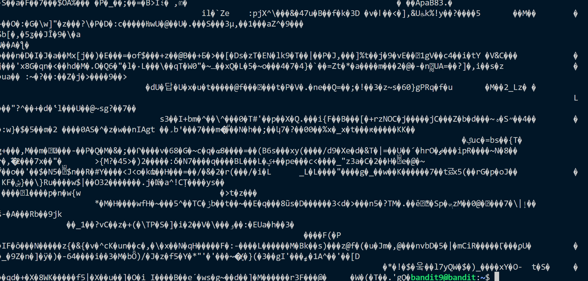
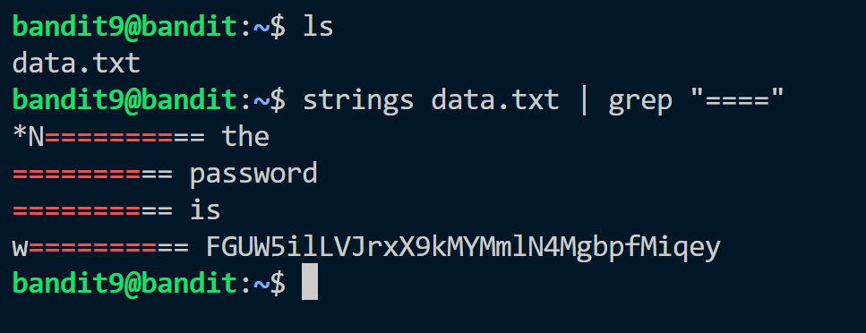

The password for the next level is stored in the file data.txt in one of the few human-readable strings, preceded by several ‘=’ characters.

we have been given data.txt. If we read the file with cat command we will get random value.


So we have to convert this data to the strings.
for this we use ```strings``` command.
After this we search the output to match for ```"===="```.
We pipe them together to get the required password.


Password: ```FGUW5ilLVJrxX9k********```