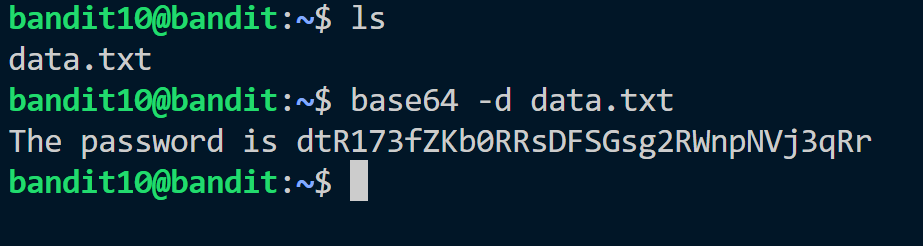

Hint:<br> 
The password for the next level is stored in the file data.txt, which contains base64 encoded data.

Solution:<br>
We have data.txt.
It is base64 encoded, we will obtain the password after decoding the file.
So, we use ```base64 -d ``` command for decoding.



