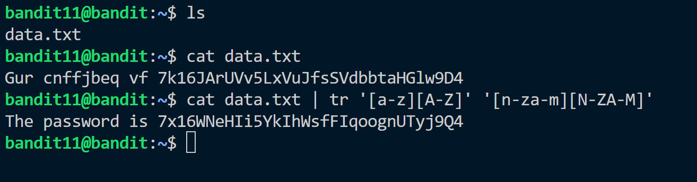

Hint:<br> The password for the next level is stored in the file data.txt, where all lowercase (a-z) and uppercase (A-Z) letters have been rotated by 13 positions.

Solution:<br>
This is ROT13 cryptography.
The data.txt file contains text which is encrypted using rot13 algorithm.
To decrypt ROT13 encryption we translate the letters 13 position.<br>
```A -> M, a -> m, n->a, N->A```<br>
Using ```tr``` command to translate we obtain the password.



Password: ```7x16WNeHIi5YkIhWsfFIqoognUTyj9Q4```