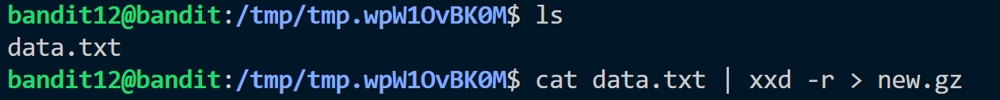
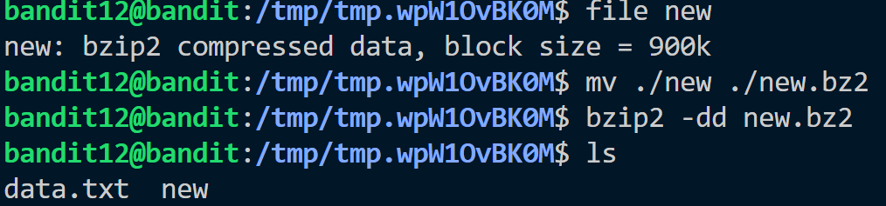
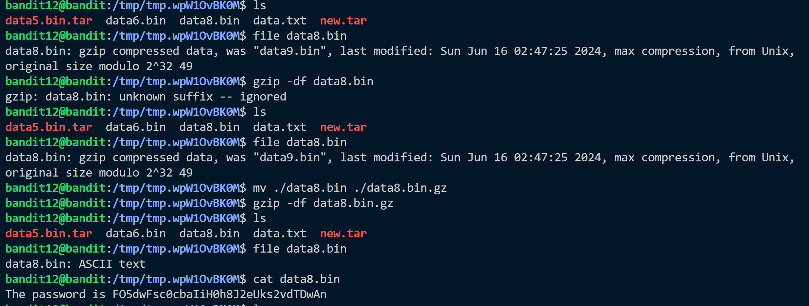

Hint:<br>
The password for the next level is stored in the file data.txt, which is a hexdump of a file that has been repeatedly compressed. For this level it may be useful to create a directory under ```/tmp``` in which you can work. Use mkdir with a hard to guess directory name. Or better, use the command ```“mktemp -d”```. Then copy the datafile using cp, and rename it using mv (read the manpages!)

Solution:<br>
We cannot create anything in the /home directory so we move to /tmp directory and copy data.txt file.
data.txt is hexdump file. To solve the problem we follow following steps:

- Convert hexdump to reverse binary file and save to a new file<br>

    
    - Here I already knew the file was gzip compressed so I added ```.gz``` after the file name. 
    > - If you do not know file type just type ```file <filename>``` and add ```.gz ``` at end using ```mv ./new ./new.gz```

- Now decompress the file ```new.gz``` using <br> ``` gzip -df new.gz```
- The output will be ```new``` again check file type 

- Repeat the process. You will have to decompress the file until you get a file with filetype ```ASCII text```.


Password: ```FO5dwFsc0cbaIiH0h8J2eUks2vdTDwAn```
