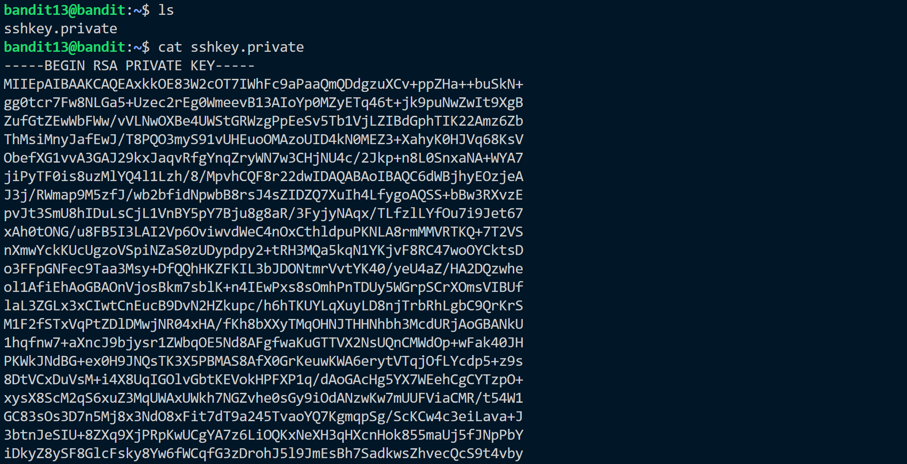

Hint:<br>
The password for the next level is stored in ```/etc/bandit_pass/bandit14``` and can only be read by user bandit14. For this level, you don’t get the next password, but you get a private SSH key that can be used to log into the next level. Note: localhost is a hostname that refers to the machine you are working on.

Solution:<br>
This level shows use of ```ssh``` command. We are given a private RSA key which can be used to log onto remote server to bandit14.



We need to change the permission of the ```ssh.privatekey``` file which cannot be done in /home so we move to /tmp copy the file there. Change ther permission of file to ```600``` using <br>
```chmod 600 ssh.privatekey```
Now we can login to bandit14 using<br>
> ``` ssh -i /tmp/tmp.L3AbrWAyXV/sshkey.private bandit14@bandit.labs.overthewire.org -p 2220```