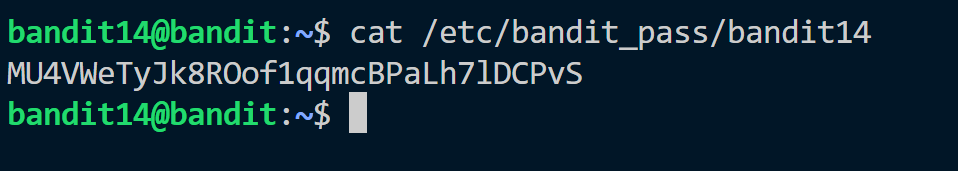
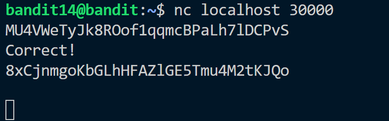

Hint: <br>
The password for the next level can be retrieved by submitting the password of the current level to port 30000 on localhost.

Solution:<br>
We already know the password to current level is in ```/etc/bandit_pass/bandit14```.

All we have to do is send the password to localhost in port 30000.<br>
This can be done by using netcat or ```nc``` command. What ```nc ``` does is that it enables to read and write data over a connection.<br>
```nc localhost 30000``` this commands listens to port 30000 of local host when provided password of current level it responds with password of next level.


Password: ```8xCjnmgoKbGLhHFAZlGE5Tmu4M2tKJQo```
