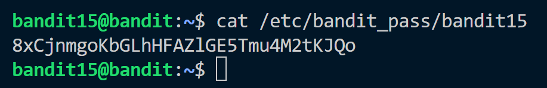
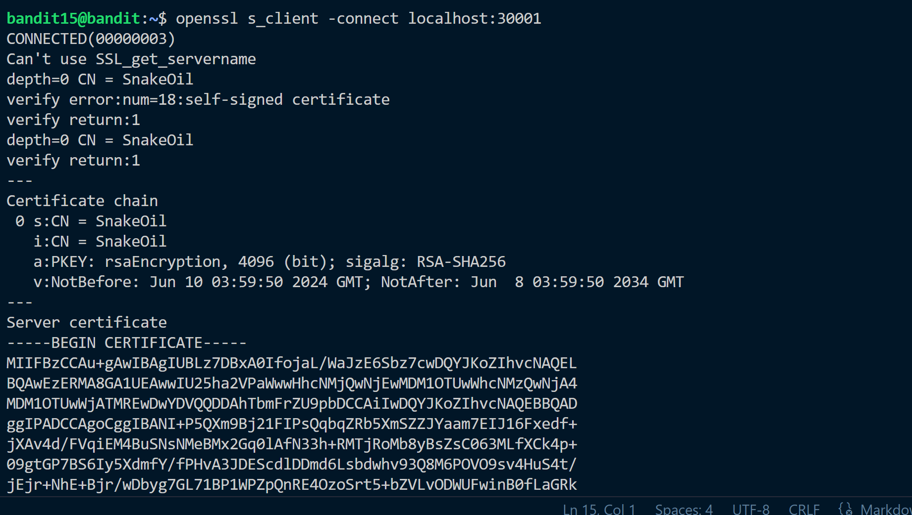
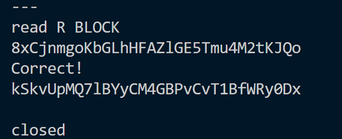

**Hint:** <br>
The password for the next level can be retrieved by submitting the password of the current level to port 30001 on localhost using SSL encryption.

> Helpful note: Getting “HEARTBEATING” and “Read R BLOCK”? Use -ign_eof and read the “CONNECTED COMMANDS” section in the manpage. Next to ‘R’ and ‘Q’, the ‘B’ command also works in this version of that command…

**Solution:**<br>
We have password of current level or we can just get from ```/etc/bandit_pass/```


We have to submit this password to localhost on port 30001 using ssl encryption.

We can implement SSL and TLS using ```openssl``` command.<br>
We need to connect to a server. Which can also be done using ```openssl```.
We use ```openssl s_client -connect``` to connect to localhost on port 30001

It provides a read block to encrypt data where we submit our password to current level.
It then sends back the password to bandit16.


