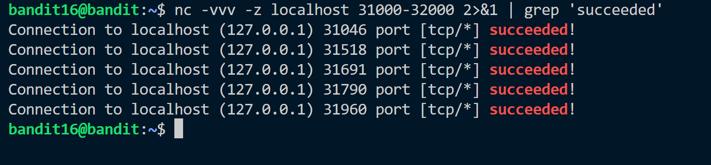
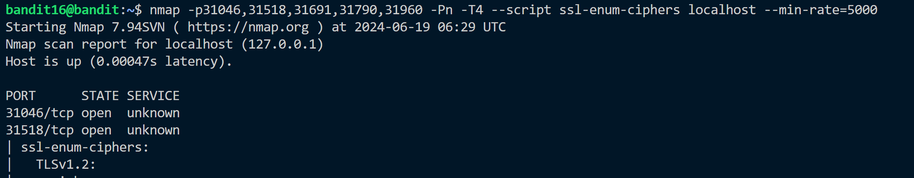
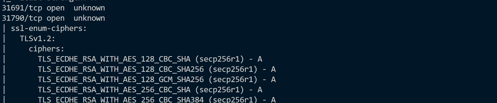
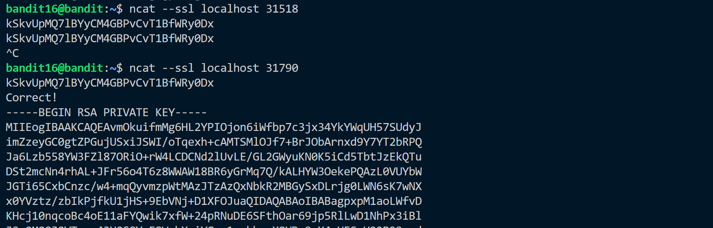

**Hint:**<br>
The credentials for the next level can be retrieved by submitting the password of the current level to a port on **localhost in the range 31000 to 32000**. First find out which of these ports have a server listening on them. Then find out which of those speak SSL and which don’t. There is only 1 server that will give the next credentials, the others will simply send back to you whatever you send to it.

**Solution:**<br>

Password of previous level is: ```kSkvUpMQ7lBYyCM4GBPvCvT1BfWRy0Dx```<br>

We use nc command to check for open ports. ```nc``` command takes in input which can be utilized to send in the password of current level. But we will not do that we will just scan ports without sending data.

We have found the open ports.<br>
From, the list of open ports using nmap to scan for those who use ssl. We found only two.



We can do ```-sV``` option with nmap but it takes time. So checking both with ```ncat``` command.
<br>Port 31518 just does echo to the input.
<br>Port 31790 is the required port, when the password of current level is sent, it responses RSA private key. 


Not copy the RSA private key.
Move to /tmp directory and create a directory using ```mktemp -d```.<br>
Now make a file with extension ```.key``` and paste the RSA key.<br>\
Change the permission of file using ```chmod 700```.


Now use ```ssh -i <key.key> bandit17@localhost -p 2220```<br>
You are now logged in as bandit17.
