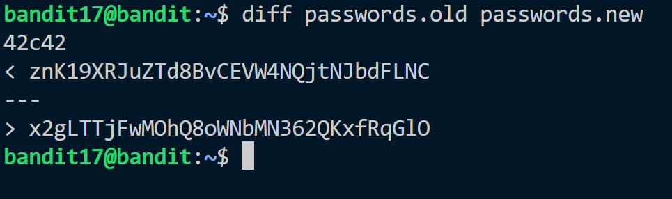
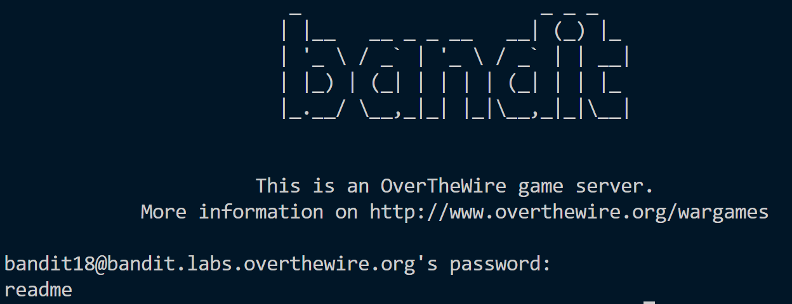
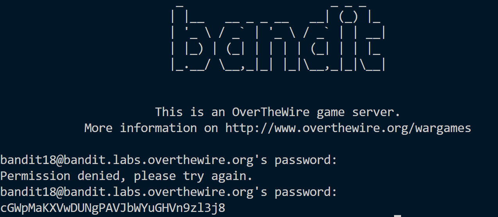

**Hint:**<br>
There are 2 files in the homedirectory: passwords.old and passwords.new. The password for the next level is in passwords.new and is the only line that has been changed between passwords.old and passwords.new

> NOTE: if you have solved this level and see ‘Byebye!’ when trying to log into bandit18, this is related to the next level, bandit19

**Solution:**<br>
Password of previous level: ```EReVavePLFHtFlFsjn3hyzMlvSuSAcRD```<br>
We have two password files. <br>
Using ```diff``` command to find the difference in the given files.

When trying to input password to ssh into bandit18 we see Byebye message. This is because .bashrc has been changed. <br>
We try to use other commands with ssh.

Now we can easily read contents of file.


Password to bandit19: ```cGWpMaKXVwDUNgPAVJbWYuGHVn9zl3j8```