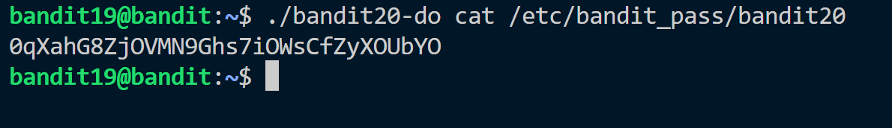

**Hint:**<br>
The password for the next level is stored in a file readme in the homedirectory. Unfortunately, someone has modified .bashrc to log you out when you log in with SSH.

**Solution:**<br>
We have bandit20-do file in home.

It is an executable file. It runs with the privileges of the file owner. It means we can execute commands, read files owned by bandit20.<br>
We already know that the password to each level is stored in ```/etc/bandit_pass/```. <br>


