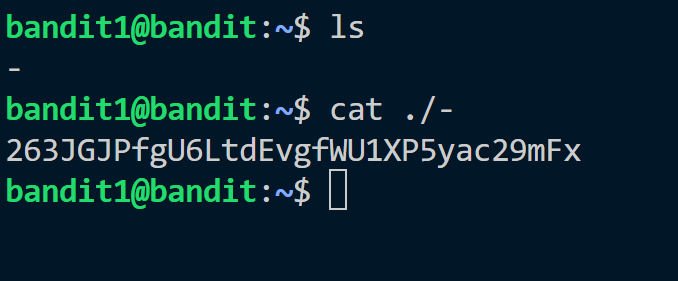

This exercise is also related to reading files using 'cat' command. 
There is a special file in the home directory. we can not directly read the file using cat command

```cat -``` 

So we use ```cat ./-``` option to read '-' file.
This command uses cat to read the file named '-' that is in current directory.
This is a option for standard input for cat .


