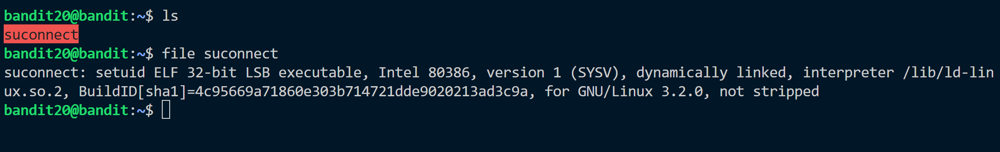
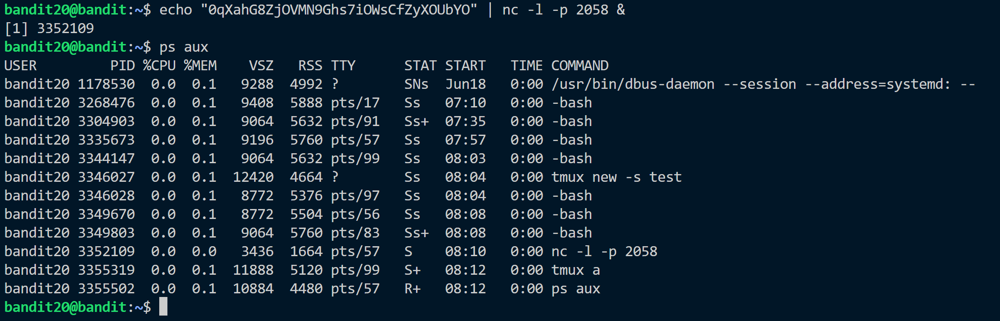
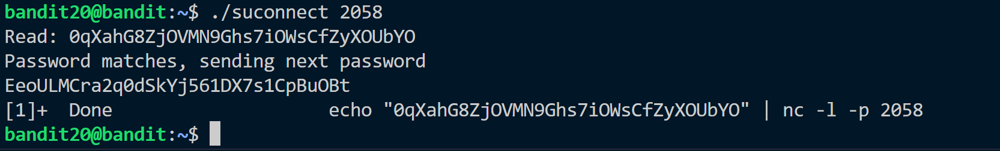

**Hint:**<br>
There is a setuid binary in the homedirectory that does the following: it makes a connection to localhost on the port you specify as a commandline argument. It then reads a line of text from the connection and compares it to the password in the previous level (bandit20). If the password is correct, it will transmit the password for the next level (bandit21).

> NOTE: Try connecting to your own network daemon to see if it works as you think

**Solution:**<br>

We have a executable file named suconnect. <br>
As hinted we need to listen to a port and connect to same port using the executable command in home directory.<br>
Password of current level: ```0qXahG8ZjOVMN9Ghs7iOWsCfZyXOUbYO``` 
<br>Send this password to a certain port. 
<br>
> ```echo "0qXahG8ZjOVMN9Ghs7iOWsCfZyXOUbYO" | nc -l -p 2058 &```

```&``` at end symbolizes that the command is running in the background. We can check using ```ps aux```

Now we connect to the port using ```./suconnect <portnumber>``` to obtain the password.<br>


Password: ```EeoULMCra2q0dSkYj561DX7s1CpBuOBt```


