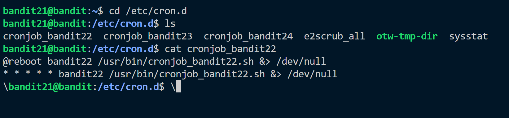
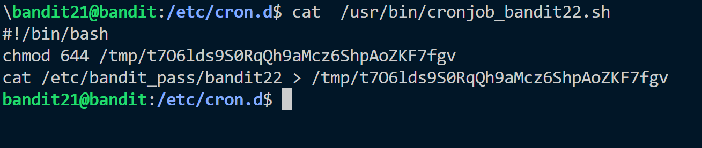
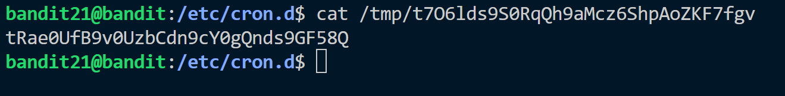

**Hint:**<br>
A program is running automatically at regular intervals from cron, the time-based job scheduler. Look in **/etc/cron.d/** for the configuration and see what command is being executed.

**Solution:**<br>
There is a file named ```cronjob_bandit22``` in ```/etc/cron.d```. It has a running task on it.


There is also a script file ```cronjob_bandit22.sh``` mentioned which contains following script.


This is a running task a temporary file is created where the password of bandit22 is sent. If we read content of ```/tmp/t7O6lds9S0RqQh9aMcz6ShpAoZKF7fgv``` we will get the password.


Password: ```tRae0UfB9v0UzbCdn9cY0gQnds9GF58Q```