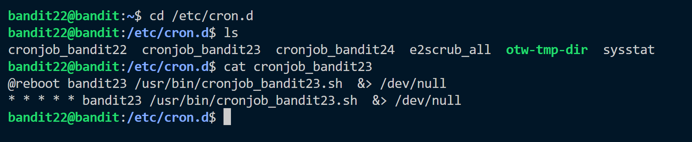
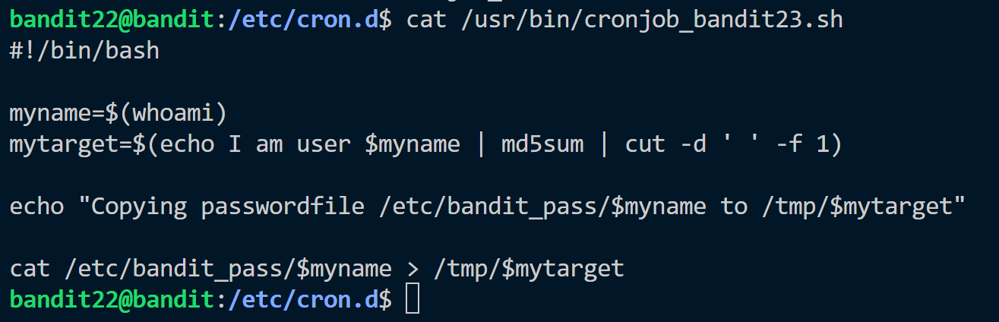
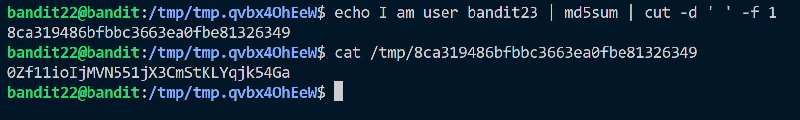

**Hint:**<br>
A program is running automatically at regular intervals from cron, the time-based job scheduler. Look in **/etc/cron.d/**for the configuration and see what command is being executed.

>NOTE: Looking at shell scripts written by other people is a very useful skill. The script for this level is intentionally made easy to read. If you are having problems understanding what it does, try executing it to see the debug information it prints.

**Solution:**<br>
This is another exercise related to cronjob. Cron jobs are scripts or commands that run at regular intervals or specific times and dates on Linux servers. 

There is a cronjob_bandit23 file which contains following task.

The script file metioned contains following script:

The script contains a md5 sum of the text I am user bandit22 which is stored in **myname** variable.<br>
The result is then used with ```/tmp/result``` where the password of bandit is placed.
Now we should run the script. This produces the password of level22.<br>
From script we can take hint that the password is saved in a /tmp dir which is md5 sum of bandit23 user.


Password: ```0Zf11ioIjMVN551jX3CmStKLYqjk54Ga```
