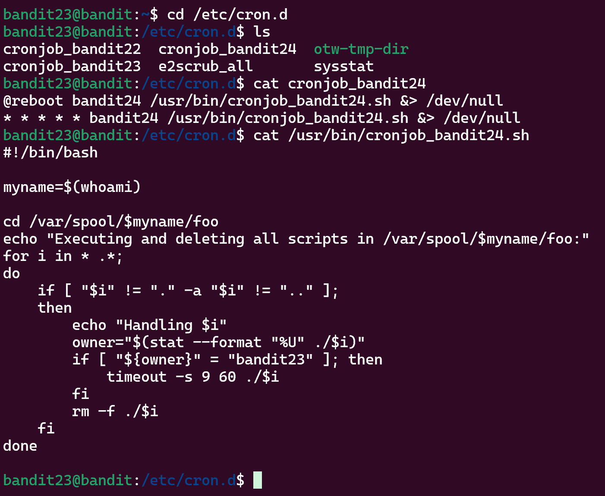
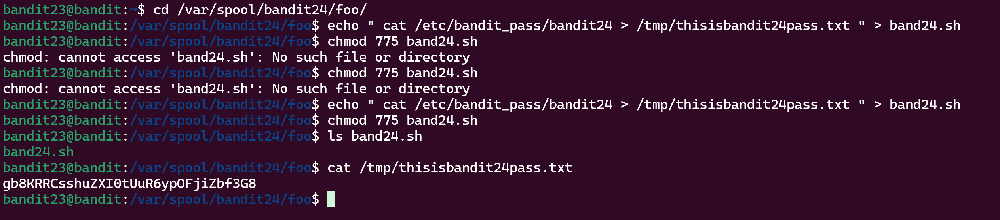

**Hint:**<br>A program is running automatically at regular intervals from cron, the time-based job scheduler. Look in **/etc/cron.d/** for the configuration and see what command is being executed.

>NOTE: This level requires you to create your own first shell-script. This is a very big step and you should be proud of yourself when you beat this level!

>NOTE 2: Keep in mind that your shell script is removed once executed, so you may want to keep a copy around…

**Solution:**<br> 
This is a pretty good exercise showing how cronjobs work. There is a script given as in other levels which executes to give bandit23 a minutes timeout and deletes files inside the ```/var/spool/bandit24/foo```.



- We go to the location pointed in script i.e. ```/var/spool/bandit24/foo```.<br>
- Run the script ``` echo " cat /etc/bandit_pass/bandit24 > /tmp/thisisbandit24pass.txt " > band24.sh```
- Change its permission to RWX.
- Wait for 60s.
- Read ```/tmp/thisisbandit24pass.txt```



