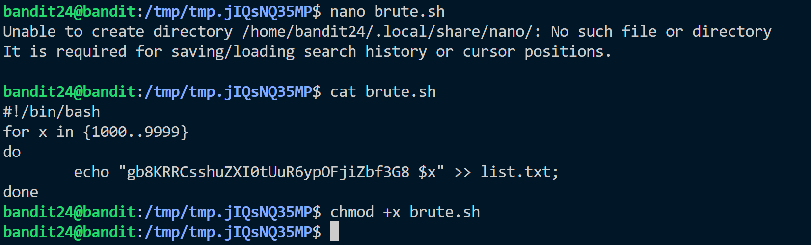
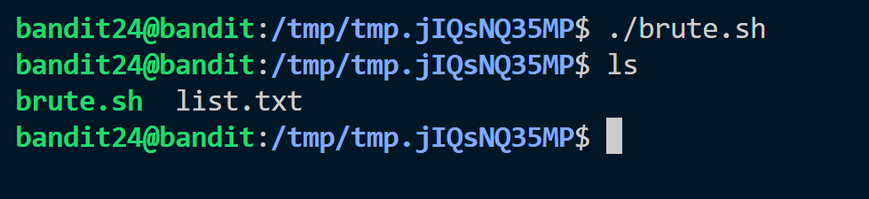

**Hint:**<br>
A daemon is listening on port 30002 and will give you the password for bandit25 if given the password for bandit24 and a secret numeric 4-digit pincode. There is no way to retrieve the pincode except by going through all of the 10000 combinations, called brute-forcing.
> You do not need to create new connections each time

**Solution:**<br>
This level introduces **"bruteforcing"**, which is a great concept to crack passwords.
<br>
- We need to run script for bruteforcing the pin and password.

- We created the script and to execute we changed its permission.
- We run the script and ```list.txt``` is created.

- Now for the final step we need to pass the combination of password of bandit24 and combination of each pin to ```localhost on 30002``` to obtain the password.


