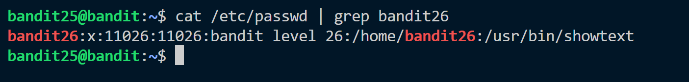
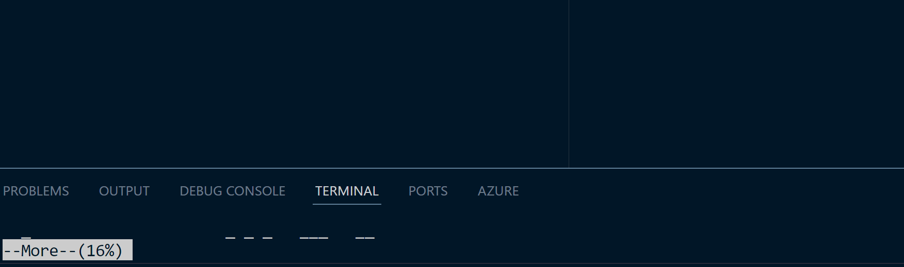
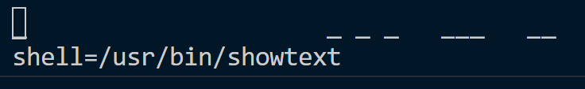
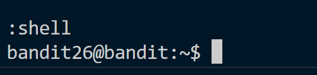
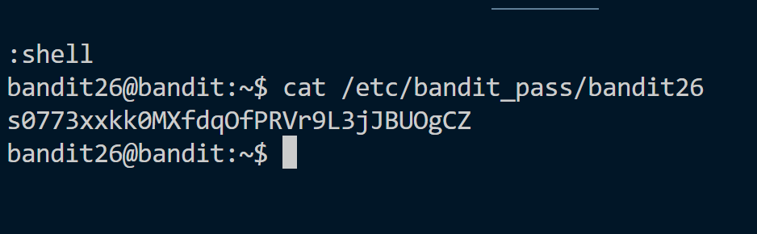

**Hint:**<br>
Logging in to bandit26 from bandit25 should be fairly easy… The shell for user bandit26 is not **/bin/bash**, but something else. Find out what it is, how it works and how to break out of it.

**Solution:**<br>
This is a good exercise including usage of ```more``` command and learning about shells.
- To begin, the shell of bandit25 is **/bin/bash** but of bandit26 is different.

- we also have a ```bandit26.sshkey```. It can be used to gain remote access of bandit26 directly. 
- the shell of bandit26 i.e. ```/usr/bin/showtext/``` shows that we can gain access to ```text.txt``` using more command.
- With these informations we can solve this level.

<br>

1. Make the terminal as small as possible.
2. Try to login to bandit26 using ```sshkey``` 

3. The more option is shown after execution. The trick is in more option. ```:``` to enter editing mode.
4. Find out the shell it is using using ```set shell?```

5. Now we need to change the shell to **/bin/bash** using ```set shell=/bin/bash``` command.
6. Now run ```shell``` command to get access to bandit26.

7. Find the password to bandit26 from ```etc/bandit_pass/bandit26```


