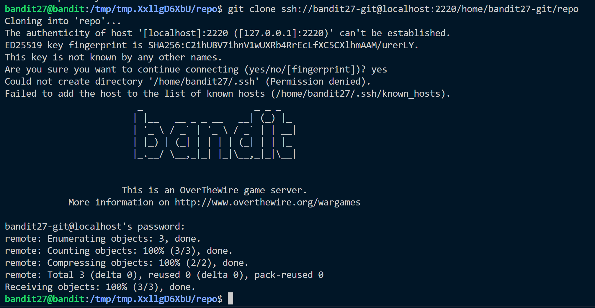
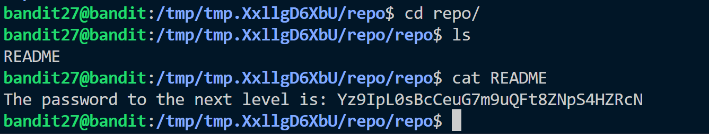

**Hint:**<br>
There is a git repository at ```ssh://bandit27-git@localhost/home/bandit27-git/repo via the port 2220.``` The password for the user bandit27-git is the same as for the user bandit27.

Clone the repository and find the password for the next level.

**Solution:**<br>
- We are given a github repo.
- We need to clone it into our system. How we donot have write access in our home directory.
- Changing to ```/tmp``` dir.

- use ```git clone``` command

```ssh://bandit27-git@localhost:2220/home/bandit27-git/repo```: The URL of the Git repository. It specifies the SSH protocol (ssh://), the username (bandit27-git), the host (localhost), the port (2220), and the path to the repository (/home/bandit27-git/repo).
- The password file is created and we can esily obtain password.

 
