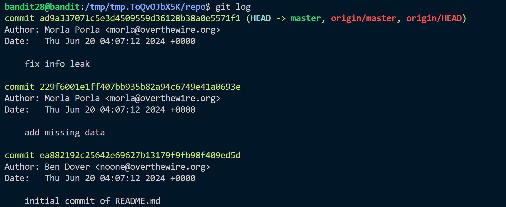
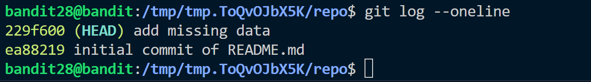
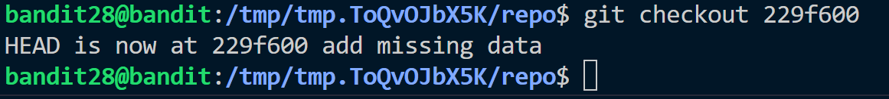
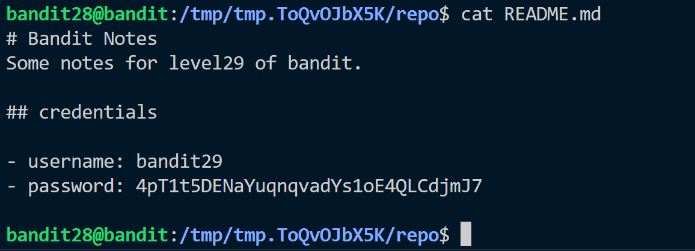

**Hint:**<br>
There is a git repository at ```ssh://bandit28-git@localhost/home/bandit28-git/repo ```via the port 2220. The password for the user bandit28-git is the same as for the user bandit28.

> Clone the repository and find the password for the next level.

**Solution:**<br>
- Change to /tmp dir
- After cloning a readme file is obtained inside ```/repo``` which includes username but password is removed.
- we can check the past logs of the file using ``` git log ``` command.

- The output shows that there are 3 commits. We can also checkout to each commit. Go to a stage where the commit took place.
- But we need a short hash which can be obtained by ```git log ---oneline```
 
- we can go to **add missing data** commit using ```git checkout```.

- Now reading content of README.md we can see the password which was removed in future commit.


Password: ```4pT1t5DENaYuqnqvadYs1oE4QLCdjmJ7```