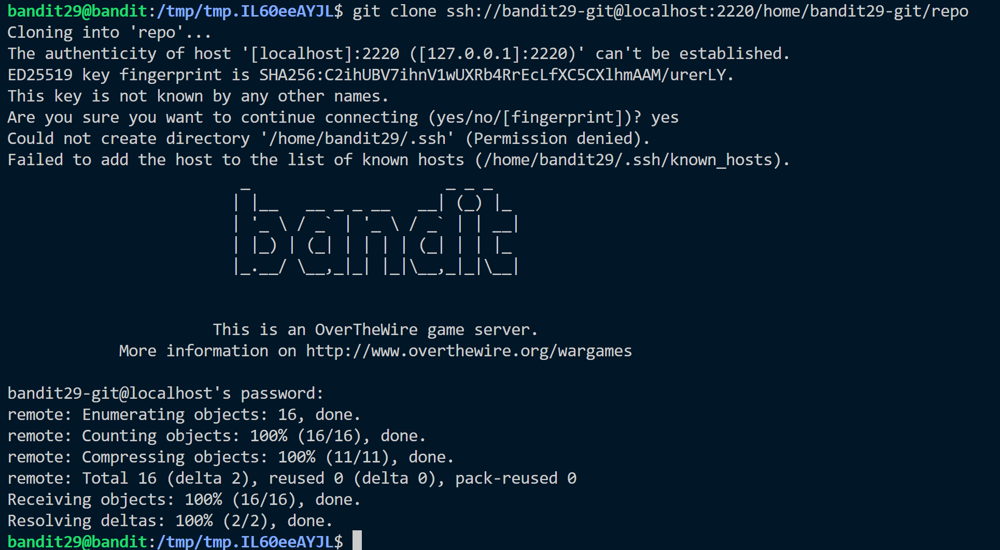
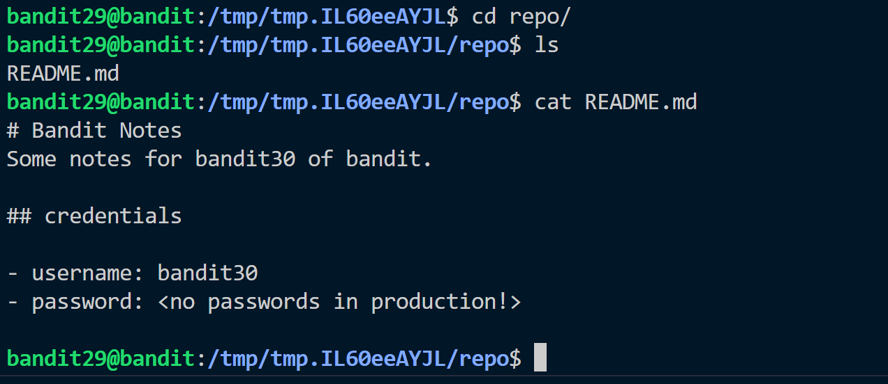
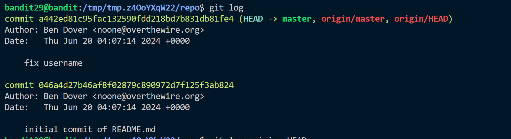
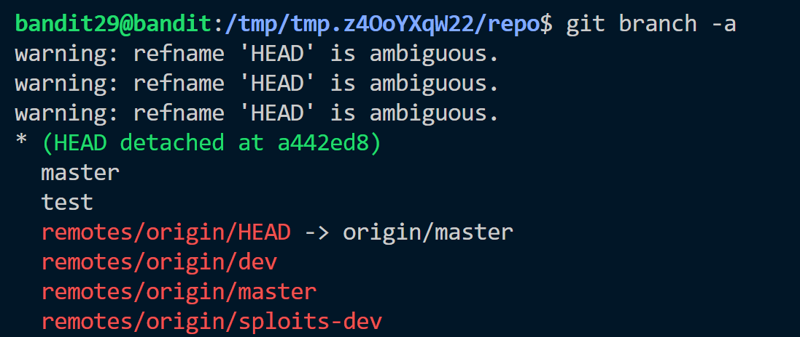
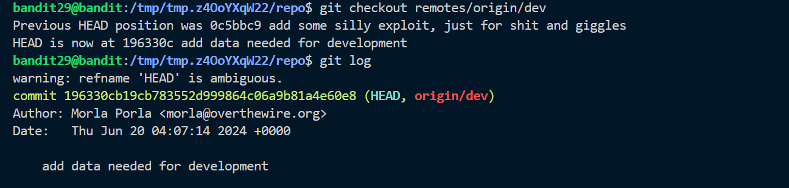
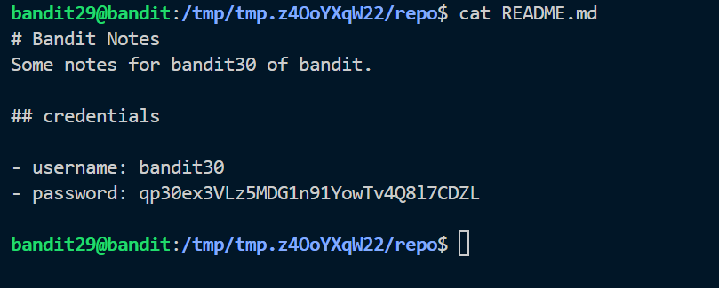

**Hint:**<br>
There is a git repository at ```ssh://bandit29-git@localhost/home/bandit29-git/repo``` via the port 2220. The password for the user bandit29-git is the same as for the user bandit29.

> Clone the repository and find the password for the next level.

**Solution:**<br>
- Clone the repo following the steps as in pervious levels.

- As in the previous levels we get a README.md file

- Check the log, we can only see two commits but more branches

- Check all the branches using ```git branch -a```, we can see several detatched branches

- checkout each branch using ```git checkout``` 

- Now read README.md file to obtain the password


