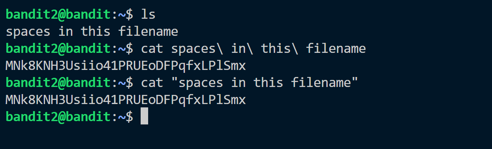

This is another exercise to read files using ```cat``` command.
There is a file which has spaces in it and ``` cat ``` command cannot directly read the file.
So we have two options using ```\``` before the spaces which says the coming part is also the part of this file.
And another is using ```" "``` to read the file.

