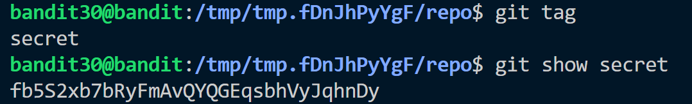

**Hint:**<br>
There is a git repository at ssh://bandit30-git@localhost/home/bandit30-git/repo via the port 2220. The password for the user bandit30-git is the same as for the user bandit30.

> Clone the repository and find the password for the next level.

**Solution:**<br>
- Clone the repo
- There is a README.md file
- Check all branches to see if password can be obtained ```git branch -a```
- use ```git tag``` to show if some of the hints are in the branches history. Sometimes git tag are also used to store some info.

- Read the tag using ```git show``` command


Password: ```fb5S2xb7bRyFmAvQYQGEqsbhVyJqhnDy```