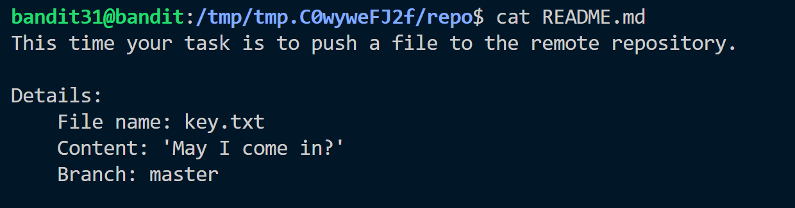
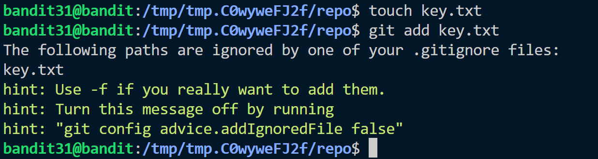
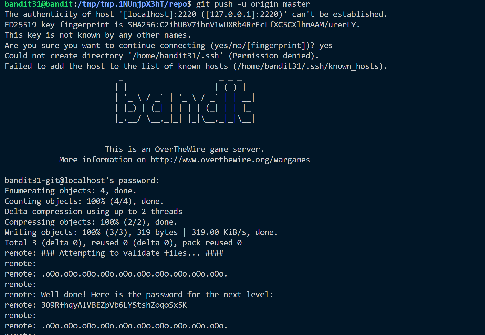

**Hint:**<br>
There is a git repository at ssh://bandit31-git@localhost/home/bandit31-git/repo via the port 2220. The password for the user bandit31-git is the same as for the user bandit31.

Clone the repository and find the password for the next level.

**Solution:**<br>
- Clone the repo
- There is README.md

- Create a key.txt file and add cotent shown into it.
- Add the file into repo, but error is recieved due to gitignore file

- Use ```git add -f key.txt```
- Then push ```git push -u origin master```, password will be shown.



Password: ```3O9RfhqyAlVBEZpVb6LYStshZoqoSx5K```
