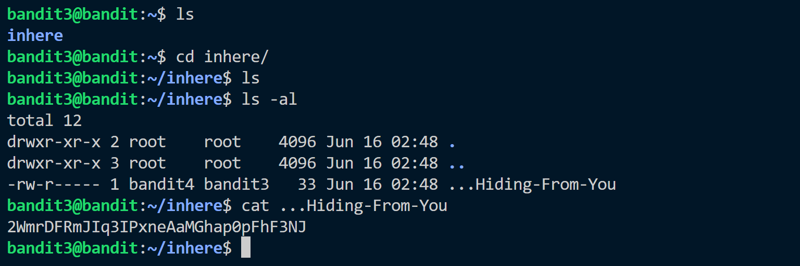

This is a good exercise showing hidden file. 
There is a hidden file in the /inhere directory which cannot be seen with just ```ls``` command.
So we use ```ls -a``` or ```ls -al``` command to view all content.
And using ```cat ``` to read the file.


