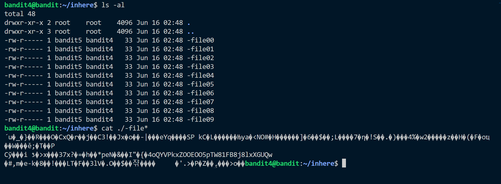
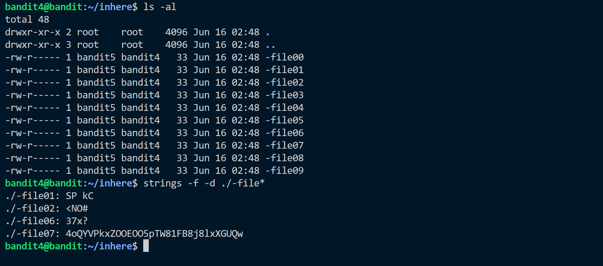

This exercise shows the use of ```strings``` command. 
The password is located in a human readable file.
So we use ```strings``` command to get the text i.e. password.



Using this we can see the password but this migh be ambigious to just copy the text.


So these file contain strings and we can see that ```-file07``` contained the password.
