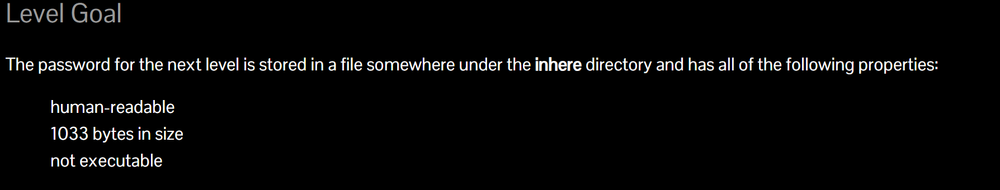
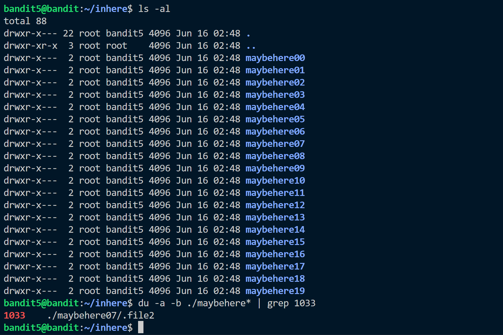
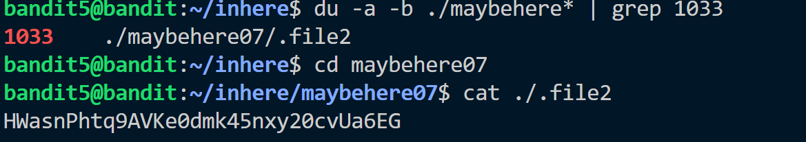

The level has following properties:



We use a new command called ```du```.
It estimates the file space usage.
It provides an option to look all files in directory and find the space of them.
You can find the details about the command here. 
<a href"https://man7.org/linux/man-pages/man1/du.1.html"> du command </a>

Using this command with ``` grep``` we can easily find the password.



