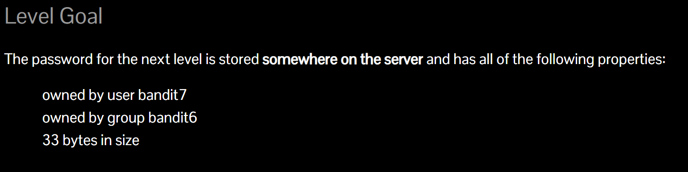
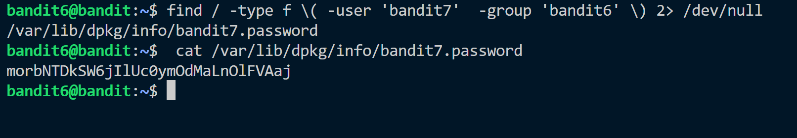

The hint for this level:


We use ```find``` command to search for files. As said in the hint the file can be anywhere in the server. So we search from the base of the file system i.e. ```/``` directory.

```find / -type f \(-user 'bandit7' -group 'bandit6'\) 2> /dev/null ```<br>
What this command does is that, it searches root directory for type ```file``` which is owned by user bandit7 and group is bandit6. ```2> /dev/null``` sends the errors to /dev/null which removes them.


We got the password: morbNTDkSW6jIlUc0ymOdMaLnOlFVAaj
