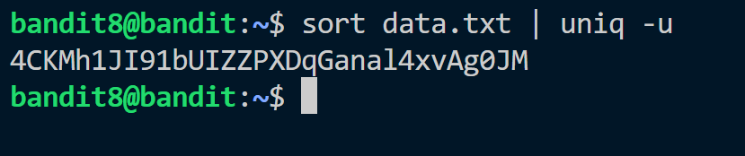

The password for the next level is stored in the file data.txt and is the only line of text that occurs only once.
All we have to do is find the unique text from the file. 
But first we have to sort the texts.



password: ```4CKMh1JI91bUIZZPXD********```